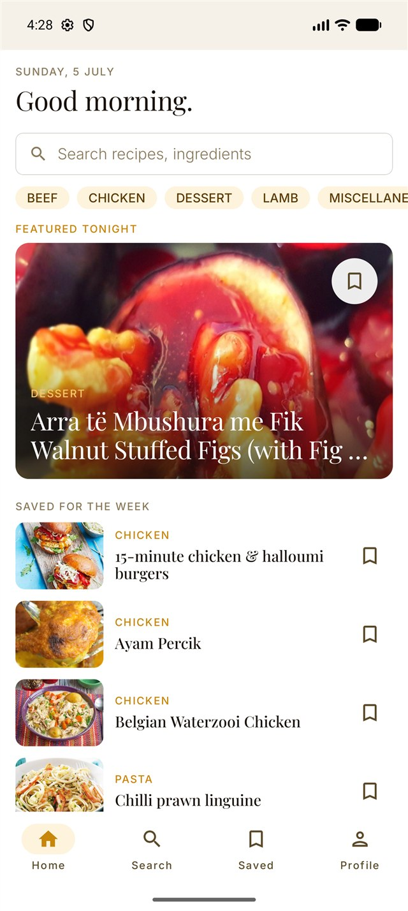
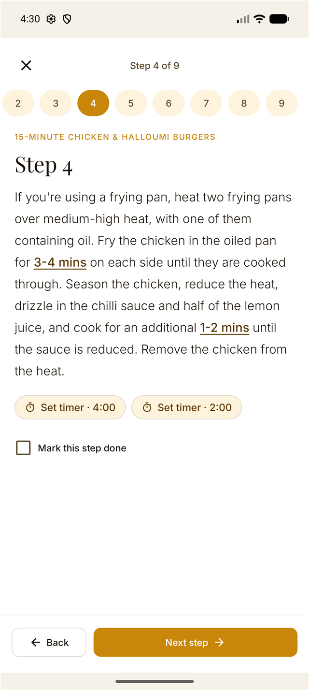
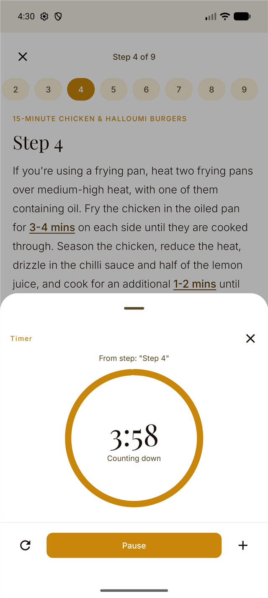
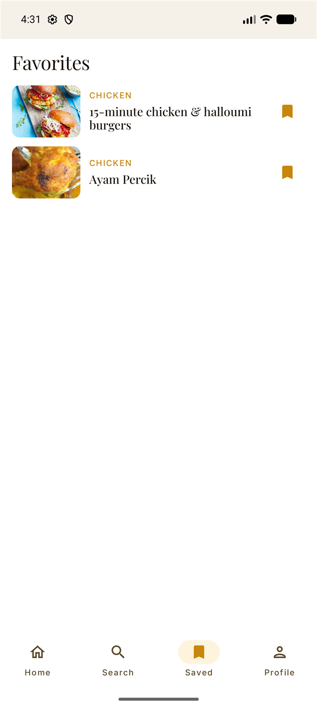
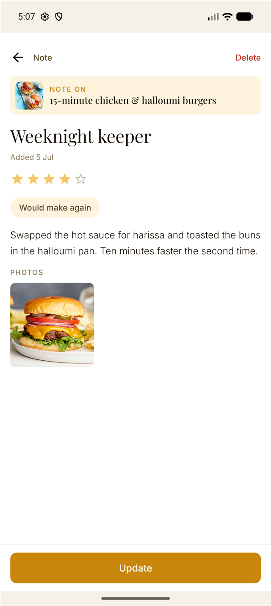
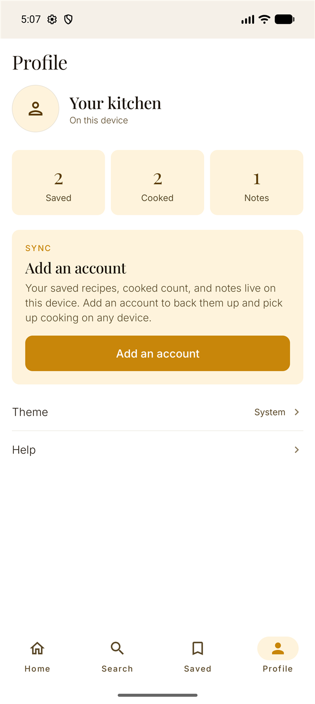
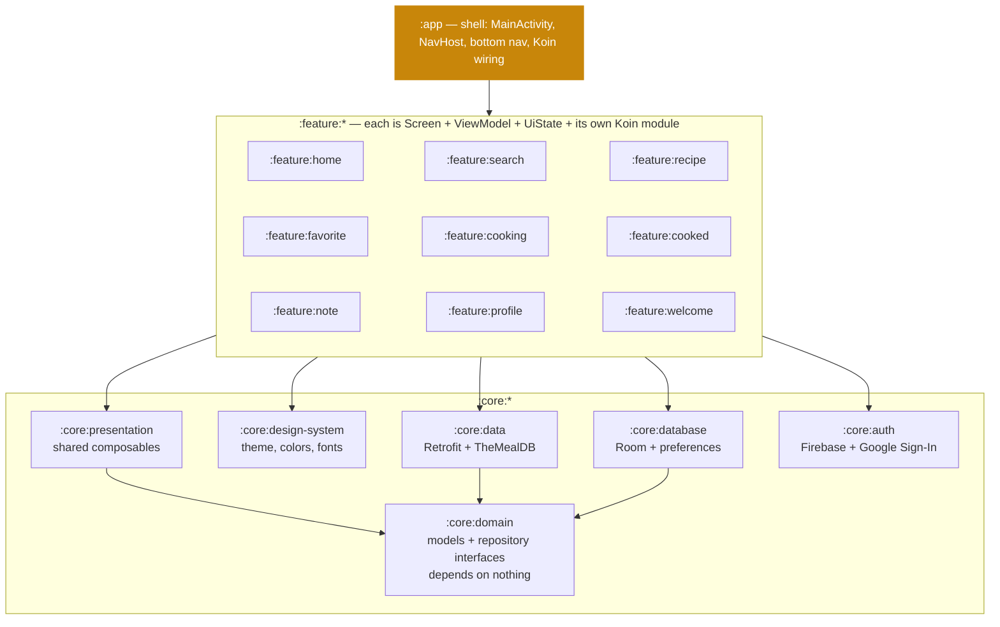

# Saffron

An editorial cooking companion for Android. Browse, cook, and remember — the food leads, and the app steps aside.


## Screenshots

Every screen ships in a hand-tuned light and dark palette — the images below follow your GitHub theme.

<table>
  <tr>
    <td>
      <picture>
        <source media="(prefers-color-scheme: dark)" srcset="assets/screenshots/home-dark.png">
        
      </picture>
    </td>
    <td>
      <picture>
        <source media="(prefers-color-scheme: dark)" srcset="assets/screenshots/cooking-dark.png">
        
      </picture>
    </td>
    <td>
      <picture>
        <source media="(prefers-color-scheme: dark)" srcset="assets/screenshots/timer-dark.png">
        
      </picture>
    </td>
  </tr>
  <tr>
    <td>
      <picture>
        <source media="(prefers-color-scheme: dark)" srcset="assets/screenshots/favorites-dark.png">
        
      </picture>
    </td>
    <td>
      <picture>
        <source media="(prefers-color-scheme: dark)" srcset="assets/screenshots/note-detail-dark.png">
        
      </picture>
    </td>
    <td>
      <picture>
        <source media="(prefers-color-scheme: dark)" srcset="assets/screenshots/profile-dark.png">
        
      </picture>
    </td>
  </tr>
</table>

## What it does

Saffron turns TheMealDB's recipe catalog into a calm, guided cooking experience — from finding a dish to cooking it step by step to writing down how it went.

- **Browse and search** — a featured pick, category chips, and debounced full-text search over recipes and ingredients, with client-side category filtering.
- **Recipe detail** — hero image, ingredient list, ratings, and a meta strip for time, servings, and difficulty.
- **Guided cooking mode** — one step per screen with progress pills, step-done tracking, and a completion sheet that flows straight into note-taking.
- **Inline step timers** — the standout feature. Time references inside instructions ("fry for 3–4 mins") are detected by a regex parser, highlighted as tappable links, and mirrored as one-tap timer chips. The timer sheet has a circular countdown, pause/resume, reset, +1 minute, and a vibration alert when time is up. Ranges like "2–3 mins" resolve to the upper bound; minutes, seconds, and hours are all understood.
- **Bookmarks that follow you** — saves are Room-backed and shared across Home, Search, Detail, and Favorites through a single reactive flow, so every bookmark icon stays in sync and survives restarts.
- **Cooking notes** — post-cook journaling with a star rating, label chips, free-form text, and up to four photos via the system Photo Picker. Notes are browsable, editable, and deletable.
- **Cooked history** — every recipe finished in cooking mode is recorded with a per-recipe cook count and last-cooked date.
- **Profile and sign-in** — live stats for saved, cooked, and notes; optional Google Sign-In via Credential Manager and Firebase Auth. Nothing is gated behind an account.
- **Theme picker** — Light, Dark, or System, persisted and applied app-wide instantly.
- **First-run polish** — a three-slide onboarding, a branded splash screen, and an adaptive launcher icon built from the Saffron thread mark.

## Design

Saffron follows a deliberately editorial design system rather than stock Material defaults. The intent is a cookbook, not a dashboard.

- One hero color — Saffron `#C8860A` — used sparingly: CTAs, active states, bookmarks.
- Playfair Display for recipe titles and screen headers; Inter Light for body copy; Inter Medium at most for labels — never bold.
- Flat surfaces: zero elevation on resting cards and buttons, hairline `0.5dp` borders instead of shadows.
- Sentence-case voice throughout. No emoji. "Saved." instead of "Amazing!".
- Dynamic color is disabled on every API level so the brand palette always wins.
- Full light and dark palettes, both hand-tuned to the same rules.

## Architecture

Single-activity Compose app, fully modularized: 17 Gradle modules plus a `build-logic` composite build.



- **Unidirectional data flow** — each screen is a `ViewModel` exposing a single immutable `UiState` via `StateFlow`; Compose renders it, events flow back up.
- **Repository pattern** — `:core:domain` defines interfaces; implementations live in `:core:data` (network) and `:core:database` (Room). Cross-screen state like bookmarks is a shared reactive `Flow` from a single Room-backed repository.
- **Koin DI** — every feature owns its DI module; the app module only assembles them.
- **Convention plugins** — shared AGP, Compose, and JVM configuration lives in the `build-logic` composite build (`saffron.android.application`, `saffron.android.library`, `saffron.android.compose`, `saffron.jvm.library`), so module build files contain only a namespace and dependencies. Built on AGP 9's built-in Kotlin support.
- **R8 release builds** — shrinking and obfuscation enabled through the AGP 9 optimization DSL.

## Tech stack

| | |
|---|---|
| Language | Kotlin 2.2.10 |
| UI | Jetpack Compose (BOM 2026.02.01) + Material 3 |
| Navigation | Navigation Compose 2.8.0 |
| DI | Koin 4.0.0 |
| Persistence | Room 2.7.1 (KSP) |
| Networking | Retrofit 2.11.0 + OkHttp, TheMealDB API |
| Images | Coil 2.7.0 |
| Auth | Firebase Auth (BOM 33.15.0) + Credential Manager |
| Async | Kotlin Coroutines + Flow 1.8.1 |
| Build | Gradle 9.5 (Kotlin DSL), AGP 9.3.0-rc01, version catalog, convention plugins |
| SDK | min 24 / target + compile 37 |

## Testing

- ViewModel unit tests for every feature (Home, Search, Recipe, Favorites, Cooking, Cooked, Notes, Profile) using JUnit 4, Truth, and Turbine over a `FakeRecipeRepository`.
- A Robolectric Compose UI test for cooking mode (`CookingModeScreenTest`) driven through a robot class (`CookingModeRobot`).
- Focused unit tests for the tricky parts: the step-timer regex parser (`ParseTimedSpansTest`) and note serialization.

```bash
./gradlew test
```

## Getting started

1. Clone the repo and open it in Android Studio.
2. Make sure the Gradle daemon runs on JDK 17 or newer (required by AGP 9).
3. Set up Firebase (required to build — see below).
4. Build and install:

```bash
./gradlew installDebug     # gradlew.bat on Windows
```

Recipes come from [TheMealDB](https://www.themealdb.com/) — free, no API key needed.

### Firebase setup

The build expects `app/google-services.json`, which is deliberately not checked in — bring your own free Firebase project:

1. Create a project in the [Firebase console](https://console.firebase.google.com/).
2. Register two Android apps in it: `com.saffron.cook` and `com.saffron.cook.debug` (debug builds get a `.debug` applicationId suffix).
3. Enable **Google** as a provider under Authentication → Sign-in method.
4. Add your debug keystore's SHA-1 fingerprint to both apps so Google Sign-In works on debug builds — get it with `./gradlew signingReport`.
5. Download the resulting `google-services.json` into `app/`.

Signing in is optional inside the app — browsing, bookmarks, cooking mode, notes, and history all work without an account. The Firebase config is only needed so the build and the optional Google Sign-In flow have a project to talk to.

### Build commands

```bash
./gradlew assembleDebug        # build debug APK
./gradlew installDebug         # install on connected device
./gradlew test                 # unit tests
./gradlew connectedAndroidTest # instrumented tests (device required)
./gradlew lint                 # Android lint
./gradlew ktlintCheck          # style + Compose rule check
./gradlew ktlintFormat         # auto-fix formatting
```

Style is enforced with ktlint 1.4.1 plus [compose-rules](https://mrmans0n.github.io/compose-rules/) for Compose-specific checks.

## Project structure

| Module | Purpose |
|---|---|
| `:app` | Application shell — activity, navigation graph, bottom nav, DI assembly |
| `:core:domain` | Domain models and repository interfaces (pure Kotlin, zero dependencies) |
| `:core:data` | TheMealDB Retrofit service, DTO mapping, repository implementation |
| `:core:database` | Room database (saved, notes, cooked), theme + onboarding preferences |
| `:core:auth` | AuthRepository interface + Firebase/Google Sign-In implementation |
| `:core:design-system` | Theme, color palettes, typography, bundled Playfair Display + Inter fonts |
| `:core:presentation` | Shared composables that depend on domain types |
| `:core:testing` | Shared test fakes and utilities |
| `:feature:home` | Featured recipe, category chips, saved-for-the-week list |
| `:feature:search` | Debounced search with filter chips |
| `:feature:recipe` | Recipe detail with ingredients and start-cooking CTA |
| `:feature:cooking` | Step-by-step cooking mode with inline timers |
| `:feature:favorite` | Saved recipes |
| `:feature:cooked` | Cooking history with per-recipe counts |
| `:feature:note` | Note list, editor, and detail |
| `:feature:profile` | Stats, Google Sign-In, theme picker |
| `:feature:welcome` | Three-slide first-launch onboarding |
| `build-logic` | Gradle convention plugins shared by all modules |
